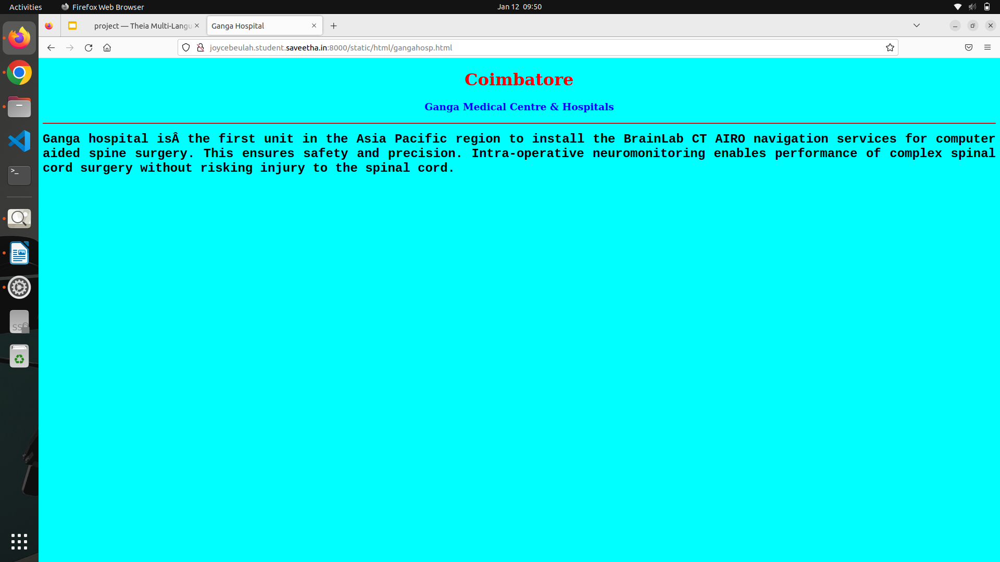

# Places Around Me
## AIM:
To develop a website to display details about the places around my house.

## Design Steps:

### Step 1:
Take a screenshot of your city from google maps

### Step 2:
Create clickable regions and execute html files

## Code:
```
map.html
<!DOCTYPE html>
<html lang="en">
<head>
<title>My City</title>
</head>
<body>
<h1 align="center">
<font color="red"><b>Coimbatore</b></font>
</h1>
<h3 align="center">
<font color="blue"><b>Joyce Beulah R (22009334)</b></font>
</h3>
<center>

<map name="MyCity">
<area shape="circle" coords="190,50,20" href="/static/html/gangahosp.html" title="Ganga Hospital">
<area shape="rectangle" coords="230,30,260,60" href="/static/html/mall.html" title="Prozone Mall">
<area shape="circle" coords="400,350,50" href="/static/html/museum.html" title="Gee Dee Museum">
<area shape="circle" coords="400,200,75" href="/static/html/themepark.html" titlle="Kovai Kondattam Amusement Park">
<area shape="rectangle" coords="490,150,870,320" href="/static/html/airport.html" title="International Airport">
</map>
</center>
</body>
</html>

gangahosp.html
<!DOCTYPE html>
<html lang="en">
<head>
<title>Ganga Hospital</title>
</head>
<body bgcolor="cyan">
<h1 align="center">
<font color="red"><b>Coimbatore</b></font>
</h1>
<h3 align="center">
<font color="blue"><b>Ganga Medical Centre & Hospitals</b></font>
</h3>
<hr size="3" color="red">
<p align="justify">
<font face="Courier New" size="5">
<b>
Ganga hospital is the first unit in the Asia Pacific region to install the BrainLab CT AIRO navigation services for computer aided spine surgery. 
This ensures safety and precision. 
Intra-operative neuromonitoring enables performance of complex spinal cord surgery without risking injury to the spinal cord.
</b>
</font>
</p>
</body>
</html>

airport.html
<!DOCTYPE html>
<html lang="en">
<head>
<title>AIRPORT</title>
</head>
<body bgcolor="lime">
<h1 align="center">
<font color="red"><b>Coimbatore</b></font>
</h1>
<h3 align="center">
<font color="blue"><b>International Airport</b></font>
</h3>
<hr size="3" color="red">
<p align="justify">
<font face="Georgia" size="5">
Coimbatore International Airport is the primary airport serving the industrial cities of Coimbatore and Tiruppur in Tamil Nadu, India. It is located in the neighbourhood of Peelamedu, about 10 km from the center of Coimbatore
</font>
</p>
</body>
</html>

themepark.html
<!DOCTYPE html>
<html lang="en">
<head>
<title>KOVAI KONDATTAM THEME PARK</title>
</head>
<body bgcolor="pink">
<h1 align="center">
<font color="red"><b>Coimbatore</b></font>
</h1>
<h3 align="center">
<font color="blue"><b>KOVAI KONDATTAM THEME PARK</b></font>
</h3>
<hr size="3" color="red">
<p align="justify">
<font face="Arial" size="5">
<b>
Kovai Kondattam is a water theme park situated 2 kilometers from Perur Temple on Siruvani Main Road at a distance of 8.5 km from the city. 
</b>
</font>
</p>
</body>
</html>

museum.html
<!DOCTYPE html>
<html lang="en">
<head>
<title>Gee Dee Museum</title>
</head>
<body bgcolor="orange">
<h1 align="center">
<font color="red"><b>Coimbatore</b></font>
</h1>
<h3 align="center">
<font color="blue"><b>Museum</b></font>
</h3>
<hr size="3" color="red">
<p align="justify">
<font face="Georgia" size="5">
Museum featuring an eclectic range of automobiles, with an emphasis on design & innovation.
</font>
</p>
</body>
</html>

mall.html
<!DOCTYPE html>
<html lang="en">
<head>
<title>Prozone Mall</title>
</head>
<body bgcolor="yellow">
<h1 align="center">
<font color="red"><b>Coimbatore</b></font>
</h1>
<h3 align="center">
<font color="blue"><b>Prozone Mall</b></font>
</h3>
<hr size="3" color="red">
<p align="justify">
<font face="Tahoma" size="5">
Prozone Mall Coimbatore is one of the largest horizontally designed shopping malls in India, covering over 500,000 sq ft. It was opened on 19 July 2017 at Sivanandapuram, Saravanampatti Road, Coimbatore. It has some attracting places like Inox fun unlimited, etc
</font>
</p>
</body>
</html>
```

## Output:




## Result:
The program for implemeting image maps is executed successfully